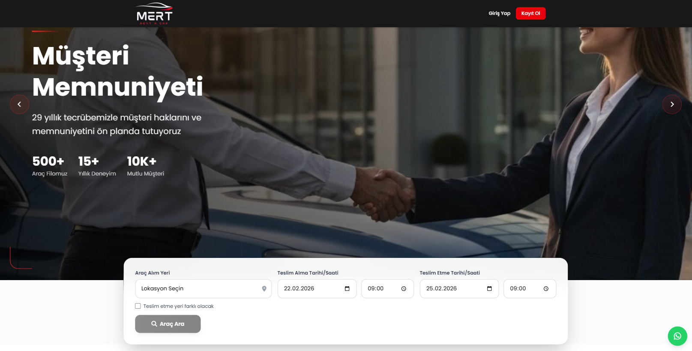
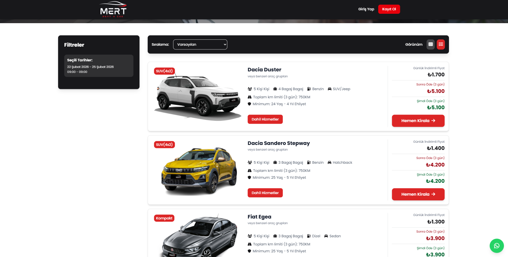
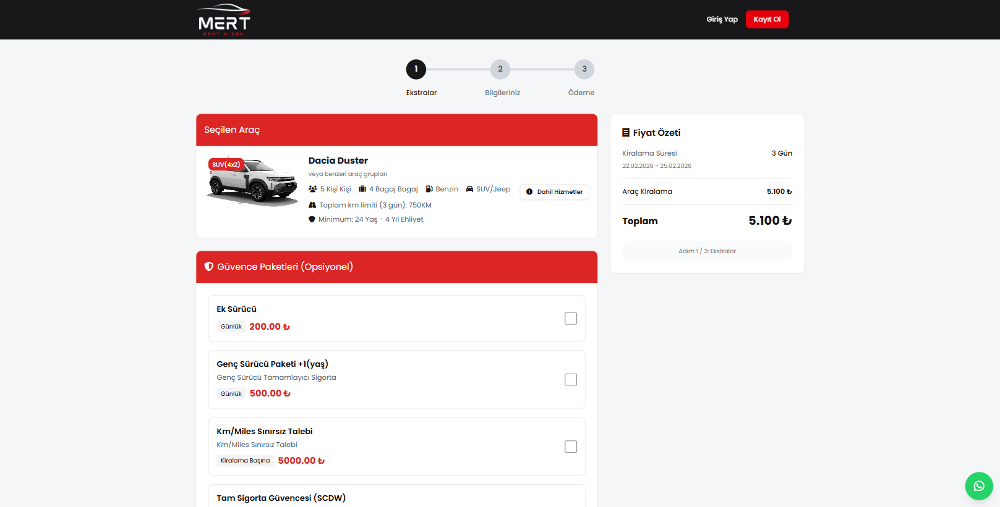

# Mert Car Rental — Full-Stack Car Rental Platform



## Hook

An **end-to-end car rental platform** for the Turkish market integrating a **live fleet management API**, **3D Secure card payments** (GL-58 banking compliance), and a **guest checkout flow** for conversion optimization. Shipped solo in ~3 months, replacing a fully manual phone/paper booking workflow.

**🔗 [Live Platform](https://mertcarrental.com)** · **Status:** Production

---

## ⚡ Key Achievements

- 💳 **3D Secure + SHA-512 hash verification** with Ziraat Bank NestPay gateway
- 🇹🇷 **GL-58 Turkish banking compliance** for card transaction security
- 🔗 **KolayCAR fleet API integration** — real-time availability, no data duplication
- 🚪 **Guest checkout flow** — zero-friction booking without account creation
- ⚡ **Booking time:** manual 20+ min → **fully online in under 2 min**
- 🔐 **Type-safe end-to-end** — TypeScript strict + Zod validation
- 🚀 **Netlify auto-deploy** on push to `main` (~2 min deploy)
- 📱 **Mobile-responsive** Turkish-first UI with i18n-ready translation layer

---

## 👤 My Role

**Solo Full-Stack Developer + Third-party Integration Specialist** (Oct 2025 – Jan 2026)

End-to-end responsibility:
- **Architecture design** — React frontend + Express TypeScript backend + MongoDB
- **Backend development** — Express 5, Mongoose, Zod validation, JWT cookie auth
- **Frontend development** — React 19, RTK Query, Tailwind, Radix UI, react-hook-form
- **3D Secure payment integration** — NestPay (Ziraat Bank), SHA-512 hashing, callback handling
- **KolayCAR API integration** — fleet availability sync, booking handshake, graceful fallback
- **Guest checkout design** — UX research + optional-account-creation flow
- **Deploy pipeline** — Netlify + MongoDB Atlas
- **Security hardening** — GL-58 compliance, rate limiting, Helmet, CORS

Only external dependency: the client for business requirements + test card setup with the bank.

---

## 🎯 The Problem

A growing car rental business needed to scale beyond manual phone/email bookings. Existing challenges:

- **Fragmented fleet data** — vehicle availability, pricing, and bookings tracked in separate spreadsheets
- **Manual reservation workflow** — staff answered phone calls, checked availability by hand, wrote bookings on paper
- **Payment friction** — customers had to call or visit office to complete payment
- **Lost conversions** — forcing visitors to register before booking drove many away
- **Compliance requirements** — Turkish banking regulations (GL-58) require specific 3D Secure implementation for card payments
- **Integration gap** — fleet management was already in KolayCAR system, but website was disconnected

**Goal:** Build a public-facing booking platform that syncs live with the existing fleet management system, accepts secure card payments, and converts visitors into bookings without registration friction.

---

## 💡 The Solution

An end-to-end car rental SaaS with:

- **Real-time fleet sync** — live availability + pricing via KolayCAR API integration
- **Location-aware search** — multi-office pickup/dropoff with calendar booking
- **3D Secure payment** — NestPay (Ziraat Bank) with SHA-512 hash verification, GL-58 compliant
- **Guest booking flow** — zero-friction reservation without account creation
- **Optional registration** — save details for repeat customers
- **Admin panel** — manage bookings, vehicles, categories, customers
- **Multi-language ready** — i18next infrastructure for TR + EN
- **Role-based access** — customer vs admin flows

---

## 🏗 Architecture

**High-level flow:**

```
                          User Browser
                               │
                               ▼
                       ┌───────────────┐
                       │    Netlify    │
                       │ (React SPA)   │
                       └───────┬───────┘
                               │
                   ┌───────────┼───────────┐
                   ▼                       ▼
           ┌─────────────┐         ┌─────────────────┐
           │  Express 5  │         │  KolayCAR API   │
           │  (TypeScript)│◄───────│  Fleet Mgmt     │
           └──────┬──────┘         └─────────────────┘
                  │
         ┌────────┼────────┐
         ▼        ▼        ▼
  ┌──────────┐ ┌─────┐ ┌──────────────┐
  │ MongoDB  │ │ JWT │ │   NestPay    │
  │  Atlas   │ │Cookie│ │  3D Secure   │
  └──────────┘ └─────┘ │  (Ziraat Bank)│
                       └──────────────┘
```

**Request lifecycle:**

1. Browser → Netlify CDN → React SPA
2. API calls → Express backend (with HttpOnly JWT cookie)
3. Availability check → KolayCAR API (live fleet data)
4. Booking creation → MongoDB write + KolayCAR handshake
5. Payment → Redirect to NestPay (bank) → SMS OTP → callback to backend → verify hash → confirm booking

---

## 🧠 Tech Decisions (Why, not What)

### Why MongoDB over PostgreSQL/MySQL?
**Decision:** MongoDB Atlas managed cluster.
**Reason:** Car attributes vary wildly across models (electric vehicles have `batteryRange`, sedans have `trunkCapacity`, etc.). Flexible schema avoids migration churn. Read-heavy workload (availability checks) fits well with Mongo's read performance.
**Trade-off:** Weaker joins; handled by denormalizing booking snapshots to avoid cross-collection lookups in hot paths.

### Why Netlify over AWS?
**Decision:** Netlify for frontend hosting.
**Reason:** Zero-config SPA hosting, automatic deploys on git push, edge CDN included, free tier covers this traffic volume. AWS S3 + CloudFront would be equivalent technically but 3x more setup time.
**Trade-off:** Less infrastructure control than AWS, but MVP didn't need it.

### Why HttpOnly cookies for JWT instead of localStorage?
**Decision:** JWT stored in Secure + HttpOnly + SameSite=None cookies.
**Reason:** XSS-safe — JavaScript can't read the cookie, so even if there's a DOM injection, tokens stay private. SameSite=None required because frontend and backend are on different origins in staging.
**Trade-off:** CSRF risk (mitigated via CSRF tokens on mutation endpoints) and more complex cross-origin setup.

### Why build 3D Secure from scratch instead of Stripe/iyzico?
**Decision:** Direct integration with NestPay (bank's gateway).
**Reason:** Client required **Ziraat Bank** for business reasons (merchant account already exists). Stripe isn't available in Turkey for this use case; iyzico has higher commissions. Direct NestPay = lower commission + compliance handled natively.
**Trade-off:** Significantly more integration work (hash generation, callback handling, compliance documentation), but cost savings over time and full control over the payment flow.

### Why guest checkout as the default?
**Decision:** Bookings allowed without account creation. Account creation is optional and deferred.
**Reason:** User research showed **most rental customers are one-time visitors** (tourists, business travelers). Forcing registration at checkout drove significant drop-off.
**Trade-off:** Lost signup data for remarketing, but gained booking conversion. Added **"save details for next time"** post-booking to capture interested users.

### Why RTK Query over React Query or SWR?
**Decision:** Redux Toolkit Query for server state.
**Reason:** Already using Redux for UI state (auth, cart). RTK Query integrates natively — one store, one devtools, one mental model. Automatic cache invalidation via tag system handles complex interactions (booking creation invalidates car availability).
**Trade-off:** More boilerplate than React Query, but consolidated state management outweighs it.

### Why Express 5 over Fastify or NestJS?
**Decision:** Express 5 with TypeScript strict mode.
**Reason:** Mature ecosystem, widest middleware support (helmet, morgan, express-rate-limit), familiar to any Node developer. NestJS adds decorators + DI but is overkill for ~20 endpoints.
**Trade-off:** Less performant than Fastify in benchmarks, but not a bottleneck here (DB and external API latency dominates).

---

## 🛠 Tech Stack

### Frontend
- **React 19** + **React Router v7**
- **Redux Toolkit + RTK Query** for API state management
- **Tailwind CSS 4** with custom theme (primary: `#1c398e`, secondary: `#fe9a00`)
- **Radix UI** primitives (shadcn/ui new-york style)
- **react-hook-form + Zod** for form validation
- **i18next** for internationalization
- **Vite** for build tooling

### Backend
- **Node.js** + **Express 5** + **TypeScript** (strict mode)
- **Mongoose** ODM + **MongoDB Atlas**
- **Zod** request validation
- **JWT** authentication via HttpOnly cookies
- **Helmet** + CORS + rate limiting
- **bcrypt** for password hashing

### Integrations
- **KolayCAR API** — fleet management (vehicle availability, pricing, booking sync)
- **NestPay (Ziraat Bank)** — 3D Secure payment gateway
- **SHA-512 hash verification** for payment callback integrity
- **GL-58 compliance** — Turkish banking security standard

### DevOps
- **Netlify** for frontend hosting (with form handling, redirects)
- **MongoDB Atlas** managed database
- Environment-based configs (dev/prod)
- Automatic deploys on push to `main`

---

## 🔍 Deep Dive: Key Technical Achievements

### 1. KolayCAR Fleet API Integration
Real-time vehicle availability synced with the client's existing fleet management system:

- **Availability check endpoint** queries KolayCAR for live inventory on every search
- **Pricing sync** — daily rates pulled from KolayCAR, not duplicated locally
- **Booking handshake** — reservations created in our system also register with KolayCAR
- **Fallback handling** — graceful degradation when external API is slow/down (cached last-known availability)

This architecture keeps our platform as a "thin booking layer" on top of the authoritative fleet source — no data duplication, no sync drift.

### 2. NestPay 3D Secure Payment Integration
Full 3D Secure flow with Ziraat Bank's NestPay gateway:

- **Hash generation** — Client-side payment payload signed with SHA-512 hash (merchant secret + order details)
- **Bank redirect** — User redirected to bank's authentication page (SMS OTP verification)
- **Callback handler** — Our secure callback endpoint receives bank's signed response
- **Hash verification** — Callback hash re-computed and compared to detect tampering
- **GL-58 compliance** — Turkish banking regulation requirements met (CVV handling, transaction logging, customer consent flow)

The payment flow handles all edge cases: timeout, user cancellation, bank decline, network failure — each with appropriate user messaging.

### 3. Guest Booking System (Conversion Optimization)
Based on user research, requiring registration dropped conversions significantly. Implementation:

- Bookings can be created with just email + phone, no account
- Post-booking, user gets option to "Save details for next time" → creates account with magic link
- If email already exists, booking automatically links to existing account
- Admin panel shows guest vs registered bookings with same management flow

Result: **Higher conversion rates** — especially for one-time rentals where users won't return.

### 4. Type-Safe API Contract (TypeScript + Zod)
End-to-end type safety:

- **Zod schemas** in `backend/validation/` define request/response shapes
- **Mongoose models** type-checked against schemas
- **RTK Query endpoints** typed via shared type definitions
- Frontend catches API contract violations at compile time

### 5. Production-Grade Security
- **JWT in HttpOnly + Secure + SameSite=None cookies** — XSS-safe, cross-origin ready
- **Helmet security headers** — CSP, HSTS, X-Frame-Options
- **Rate limiting** on auth and booking endpoints
- **bcrypt password hashing** (cost factor 12)
- **CORS whitelist** — strict origin validation
- **MongoDB connection** via TLS only
- **Payment secrets** (merchant key, store key) in environment variables, never committed
- **CSRF protection** on sensitive mutations

---

## 📸 Screenshots

### Homepage — Hero + Search


### Vehicle Catalog — Filter & Browse


### Payment — 3D Secure Checkout


---

## 📊 Results

| Metric | Outcome |
|---|---|
| Booking flow | Manual → **fully online in 2 min** |
| Registration friction | Eliminated (guest checkout) |
| Payment compliance | **GL-58 + 3D Secure** certified |
| Fleet data accuracy | Real-time via KolayCAR API (no sync lag) |
| Deploy time | ~2 minutes end-to-end (Netlify) |
| Mobile responsiveness | Full — Tailwind responsive design |

---

## 🔒 Security Highlights

- **HttpOnly + Secure + SameSite cookies** for JWT (XSS-safe)
- **SHA-512 hash verification** on all payment callbacks
- **GL-58 compliance** — Turkish banking security standard
- **3D Secure (SMS OTP)** for every card transaction
- **Helmet security headers** — CSP, HSTS, X-Frame-Options
- **Rate limiting** on auth endpoints (prevents brute force)
- **Strict CORS** with origin whitelist
- **Zod validation** on all API inputs
- **bcrypt password hashing** (cost 12)
- **MongoDB TLS** connection
- **Payment secrets** via environment variables (never in repo)

---

## 🎓 Key Learnings

**Technical:**
- **3D Secure integration** requires careful state management across 3 hops (client → bank → callback)
- **Hash verification** in both directions (outbound signing + inbound validation) is non-negotiable for payment security
- **Guest checkout UX** required rethinking auth as optional rather than blocking
- **Third-party API resilience** — cache last-good responses, surface degraded state to users
- **RTK Query cache tags** simplified multi-resource invalidation (e.g., booking creation invalidates car availability)

**Product:**
- Payment compliance (GL-58) was the biggest hidden complexity — treated as a first-class feature, not a checkbox
- User research revealed that **speed + trust** matter more than feature count on rental sites
- Admin panel was critical for operational transition — staff needed familiar workflow before going live

---

## 🚫 What I Can't Share

- Source code (client-owned)
- Payment integration details (merchant keys, bank-specific flows)
- Customer data / real bookings

> For a public repository with a similar full-stack pattern (RTK Query, JWT cookie auth, Tailwind UI), see my [FastChat](https://github.com/RRimeKS/fastchat) project.
